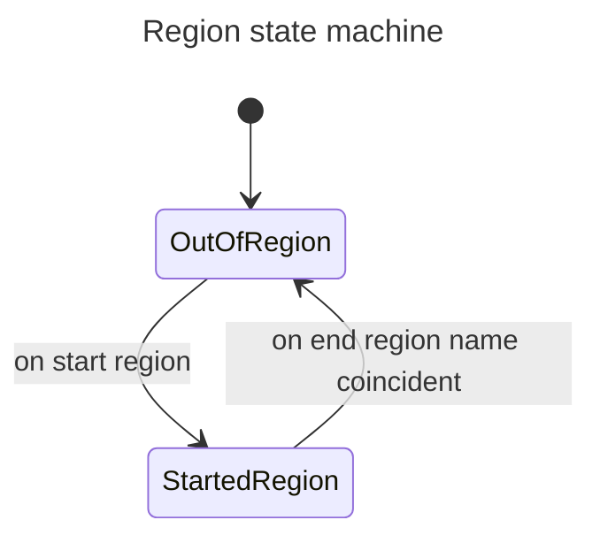
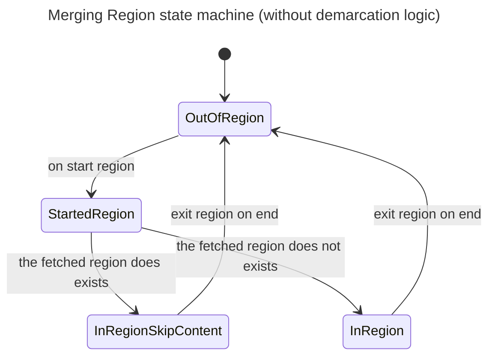

# README

## Regions

Nella fase di merging si applicano le seguenti modalità.
Nella colonna current la condizione sul documento esistente mentre sulla colonna new il documento in fase di generazione.

| new                    | current                          | behaviour                      |
|------------------------|----------------------------------|--------------------------------|
| the region is empty    | the region is not present        | use the new region content     |
| the region is empty    | the region exists and empty      | use the new region content     |
| the region is empty    | the region exists with content   | use the current region content |
| the region has content | the region is not present        | use the new region content     |
| the region has content | the region is  present and empty | use the new region content     |
| the region has content | the region exists with content   | keep the old content           |

Bottom line: if the current region exists and has content use that content, otherwise use the new content (empty or not).

